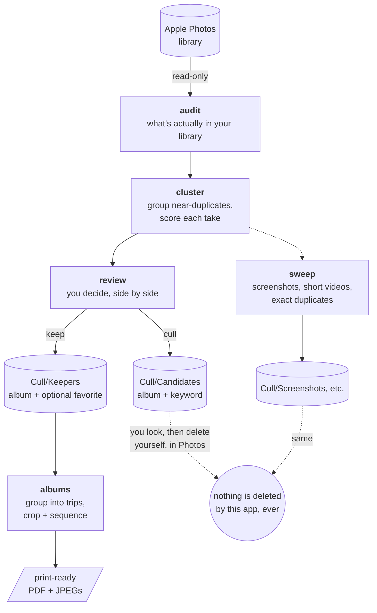

# photocull

Cull a large Apple Photos library down to keepers, on your own Mac, without sending a
single byte anywhere.

It groups near-identical takes — the seven frames of the same shot you meant to thin
out five years ago — and scores each one on sharpness, exposure, eye-openness, framing,
and horizon, then proposes which to keep. You review the proposals side by side and
decide. Once you've culled, a bulk sweep clears out the obvious junk (old screenshots,
short videos, exact duplicates), and an album builder turns your favorites into
print-ready 4x6/5x7 PDFs.

What it never does is delete anything.

**Status:** working end to end against a real, multi-thousand-item library — every
stage below runs today. `docs/SPEC.md` covers how each one works.

## What it won't do

**It never deletes anything from your Photos library** — not a photo, not an album,
not a keyword. The only changes it can make: set favorite, add to an album, set or add
a keyword. Photos it proposes culling go into a `Cull/Candidates` album; deleting them
is something you do yourself, in Photos, after you've looked at that album.

That's enforced, not just promised: `tests/test_guardrails.py` walks the syntax tree of
every source file and fails the build on any call or attribute named `delete`,
`remove`, `erase`, `unlink`, `rmtree`, `trash`, or `destroy` — zero of those calls are
allowed, anywhere. The same test also greps comments and strings for `delete`,
`remove`, or `erase`, and requires a reason logged in the test file itself before it'll
let one through, so even a stray mention of those doesn't slip in unnoticed.

It won't download your photos from iCloud either, except when a step actually needs
the original — album export, for the specific photos you're printing. Every other
stage reads only the thumbnails Photos already cached locally, which on a typical
optimized library means reading 14,000 files instead of downloading them. The review
UI can also fetch a single full-resolution photo on demand, if the local pixels
genuinely can't settle a comparison.

## Requirements

- macOS, and a Mac whose Photos library is on it
- Python 3.12+ (developed on 3.14)
- **Full Disk Access granted to your terminal** — see below

## Install

This is a developer tool. There's no `.app`, no installer, no signed binary — you run
it from a checkout, in a terminal.

```bash
git clone <this repo> && cd photocull
python3 -m venv .venv && source .venv/bin/activate

pip install -e ".[dev]"                 # audit, clustering, scoring, sweep
pip install -e ".[dev,review]"          # + the review UI (browse clusters, write back)
pip install -e ".[dev,album]"           # + the print-album builder
pip install -e ".[dev,review,album]"    # everything
```

### Full Disk Access

`osxphotos` reads your Photos library's SQLite database directly, and macOS gates that
behind Full Disk Access. Grant it to whichever terminal you run `photocull` from —
Terminal, iTerm, your editor's built-in terminal — in System Settings → Privacy &
Security → Full Disk Access, then restart it if needed.

What `photocull` actually does with the access: read your Photos library's metadata
database and its locally-cached thumbnails, read-only. Nothing gets uploaded, no
network calls, no third parties.

One thing worth knowing: that permission applies to the terminal, not to `photocull`
specifically, so anything else you run in that terminal afterward can read any file on
disk too. That's just how macOS's permission model works, not something this app
chose.

If you'd rather not grant it, this won't work — there's no way to read a Photos library
without it.

## Quick start

Try the UIs with zero Photos access first — both ship a synthetic demo library, so you
can see how review and album-sequencing work before granting anything:

```bash
photocull review --demo          # cull a synthetic 24-cluster library
photocull albums serve --demo    # sequence a synthetic two-trip album pool
```

Once you've granted Full Disk Access, the real workflow:

```bash
source .venv/bin/activate

photocull audit                          # read-only: what's actually in your library
photocull audit --json-out out/audit.json

photocull cluster                        # group near-duplicates and score each take
photocull calibrate                      # export a review sample: out/calibration/sample.html
```

`photocull calibrate` writes a contact sheet showing proposed keepers beside the takes
they beat. Open it before trusting any threshold — it's how you find out whether the
grouping matches your own judgment. The settings it suggests go in a `photocull.toml`
next to the repo (copy `photocull.example.toml`; every value ships commented out, so an
untouched copy behaves exactly like the defaults).

```bash
photocull review                         # decide keepers, cluster by cluster (dry run by default)
photocull review --allow-write-back      # actually write favorite/album/keyword back to Photos

photocull sweep --dry-run                # preview screenshots, short videos, exact dupes
photocull sweep --allow-write-back       # write that back too

photocull albums list                    # see trip groupings in your keeper pool
photocull albums serve                   # sequence an album, adjust crops, in the browser
photocull albums export --album-id <id>  # render the print-ready PDF + full-res JPEGs
```

Every write-back command defaults to a dry run and needs an explicit flag to touch your
library. Even then, all it can touch is favorite/album/keyword.

Run the tests with `pytest -q`. They use synthetic fixtures throughout and need no
Photos access at all.

## How it works



Solid arrows are what `photocull` does on its own; dashed arrows are the one step it
never takes for you. Every write-back (favorite / album / keyword) needs an explicit
`--allow-write-back` flag and defaults to a dry run — see Quick start above.

`docs/SPEC.md` walks through the pipeline stage by stage — the clustering algorithm,
the scoring model, the review UI's design decisions, and the album export pipeline —
for anyone who wants the detail behind what each command above actually does.

## Development

Built with Claude Code (AI pair-programming) alongside manual review and testing —
that's just how it was made, not a pitch. If you're changing the code yourself, human
or agent, `AGENTS.md` has the engineering constraints this README doesn't cover: where
Photos access is allowed to happen, and how the guardrail tests enforce it.

## Your data

Everything stays on your machine. The analysis cache (`out/analysis.db`), the
calibration sample, and your `photocull.toml` are all git-ignored and never leave the
disk. No telemetry, no crash reporting, no account.

## License

MIT — see `LICENSE`.
